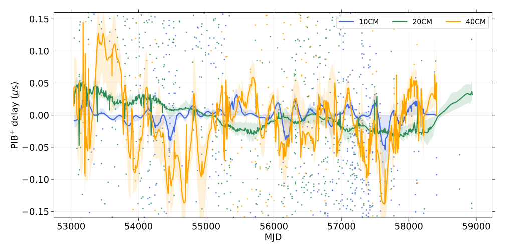

# PPTA polarization-calibration model

This repository implements a polarization-calibration Gaussian-process model
for PPTA timing data using
[`enterprise`](https://github.com/nanograv/enterprise) and
[`enterprise_warp`](https://github.com/bvgoncharov/enterprise_warp). The model
multiplies an X, Y, or Z Fourier basis by a three-component instrumental
distortion vector for every time of arrival (TOA), optionally projected using
the parallactic angle.




## Important: attach the deltas first

Every `enterprise.Pulsar` must have its per-TOA distortion vectors attached as
`psr.distort_vect` **before the pulsar is used to construct the PTA model**.
`pib.py` declares `distort_vect` as an automatically injected Enterprise
argument, so attaching it after model/PTA construction is too late.

The required order is:

1. Load the pulsars.
2. Build the distortion-vector dictionary.
3. Call `attach_deltas(...)` and check that each result has shape
   `(number_of_TOAs, 3)`.
4. Create the polarization signals.
5. Apply the complete signal model to the pulsars and construct the PTA.
6. Pass parameter vectors to `pta.get_lnlikelihood(...)`.

For the data layout supplied with this project:

```python
from pathlib import Path

import numpy as np

# enterprise_warp_mod.py is the modified enterprise_warp module containing
# attach_deltas. When using enterprise_warp as an installed package, port/use
# this function in that package before initializing the PTA.
from enterprise_warp.enterprise_warp import attach_deltas

root = Path("/path/to/PPTA_Pol_cal")
delta_dir = root / "analysis" / "distortion_vectors_DR2"

psr_names = np.loadtxt(
    delta_dir / "delta_10cm.txt", dtype=str, usecols=0
)

band_files = {
    "10CM": delta_dir / "delta_10cm.txt",
    "20CM": delta_dir / "delta_20cm.txt",
    # The 40-cm values are stored in the historical delta_50cm filename.
    "40CM": delta_dir / "delta_50cm.txt",
}
band_deltas = {
    band: np.loadtxt(path, usecols=(1, 2, 3))
    for band, path in band_files.items()
}

global_delta = {
    name: {band: values[i] for band, values in band_deltas.items()}
    for i, name in enumerate(psr_names)
}

# `psrs` is a list of enterprise.Pulsar objects. The values in psr.flags["B"]
# must match the keys above and be in the same TOA order as the angle files.
attach_deltas(
    psrs,
    global_delta,
    pa_path=str(root / "analysis" / "data_dr2_23") + "/",
    hand="left",       # or "right"
    project=True,
)

for psr in psrs:
    assert psr.distort_vect.shape == (len(psr.toas), 3)
```

When `project=True`, `pa_path` must contain one `<PSR>.ang` file per pulsar.
Its second column is interpreted as the parallactic angle in degrees, with one
row per TOA. Set `project=False` to attach the unprojected delta vectors.

## Create and add the polarization signal

`pib.create_polarization_signals(...)` builds X, Y, and Z power-law Fourier
GPs for every requested backend/band and returns their combined Enterprise
signal. For PPTA data, use:

```python
import pib

b_flags = ["10CM", "20CM", "40CM"]

pol_signal = pib.create_polarization_signals(
    b_flags,
    nfreqs=nfreqs,
    Tspan=self.params.Tspan,
    log_A_range=(-18, -6),
    gamma_range=(0, 7),
    combine=self.params.combine,
    gamma_type="common",
)
```

With `gamma_type="common"`, X, Y, and Z share one spectral index within each
band, while each axis has its own amplitude. Use `gamma_type="indep"` for a
separate spectral index on every axis. `flagname` defaults to the PPTA `-B`
flag.

Add the result to the timing and noise signals before applying the model to
each pulsar:

```python
from enterprise.signals import gp_signals, signal_base

timing_model = gp_signals.TimingModel(
    use_svd=True,
    combine=self.params.combine,
)
full_signal = timing_model + pol_signal  # add other noise terms here

# psrs already contain .distort_vect from attach_deltas(...).
models = [full_signal(psr) for psr in psrs]
pta = signal_base.PTA(models)

x0 = np.hstack([parameter.sample() for parameter in pta.params])
log_likelihood = pta.get_lnlikelihood(x0)
```

The same construction is integrated in `PPTADR2Models.gwb()`: an option
containing `pol_dist_selec` calls `create_polarization_signals` with the three
PPTA bands. The example JSON configuration uses
`"gwb": "pol_dist_selec_30_nfreqs"`.

## Files

- `pib.py` defines the distortion-weighted Fourier bases and
  `create_polarization_signals`.
- `ppta_dr2_models.py` exposes the polarization process through the custom
  `PPTADR2Models` class used by `enterprise_warp`.
- `enterprise_warp_mod.py` shows the required changes to pulsar loading,
  including `attach_deltas`, projection handedness, and automatic attachment
  when `pol_cal: True`.
- `pol_recon.py` contains posterior reconstruction and plotting helpers.
- `analysis/distortion_vectors_DR2/` contains the band-dependent delta vectors.
- `analysis/data_dr2_23/` contains the `.par`, `.tim`, and parallactic-angle
  `.ang` files.
- `analysis/noise_models/` contains example `enterprise_warp` parameter and
  JSON model files.

## Dependencies

The core code requires Python with `numpy`, `scipy`, `astropy`, `enterprise`,
`enterprise_extensions`, and `enterprise_warp`. A compatible sampler such as
Bilby, PTMCMC, or pocoMC is additionally required to generate posterior
samples.

## References and data

- [`enterprise_warp` documentation](https://enterprise-warp.readthedocs.io/en/latest/)
- [Parkes Pulsar Timing Array Third Data Release (part 1 of 2), version 2](https://data.csiro.au/collection/csiro%3A59374v2)
- [Parkes Pulsar Timing Array Third Data Release (part 2 of 2), version 2](https://data.csiro.au/collection/csiro%3A59381v2)
